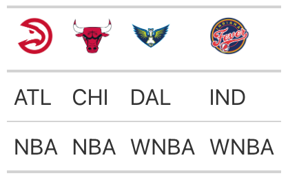

# Render Logos in 'gt' Table Column Labels

Translate NBA/WNBA team abbreviations into logos and render these images
in column labels of 'gt' tables.

## Usage

``` r
gt_nba_cols_label(
  gt_object,
  columns = gt::everything(),
  ...,
  height = 30,
  league = c("NBA", "WNBA")
)
```

## Arguments

- gt_object:

  A table object that is created using the
  [`gt::gt()`](https://gt.rstudio.com/reference/gt.html) function.

- columns:

  The columns for which the image translation should be applied.
  Argument has no effect if `locations` is not `NULL`.

- ...:

  Currently not in use

- height:

  The absolute height (px) of the image in the table cell.

- league:

  One of `"NBA"`, `"WNBA"`

## Value

An object of class `gt_tbl`.

## Output of below example



## See also

The logo rendering functions
[`gt_nba_logos()`](https://mrcaseb.github.io/nbaplotR/reference/gt_nba_logos.md)
and
[`gt_wnba_logos()`](https://mrcaseb.github.io/nbaplotR/reference/gt_wnba_logos.md).

## Examples

``` r
# \donttest{
label_df <- data.frame(
  "ATL" = c("ATL", "NBA"),
  "CHI" = c("CHI", "NBA"),
  "DAL" = c("DAL", "WNBA"),
  "IND" = c("IND", "WNBA")
)
# create gt table and translate player IDs and team abbreviations
# into headshots, logos, and wordmarks
table <- gt::gt(label_df) |>
  nbaplotR::gt_nba_cols_label(columns = c("ATL", "CHI"), league = "NBA") |>
  nbaplotR::gt_nba_cols_label(columns = c("DAL", "IND"), league = "WNBA")
# }
```
