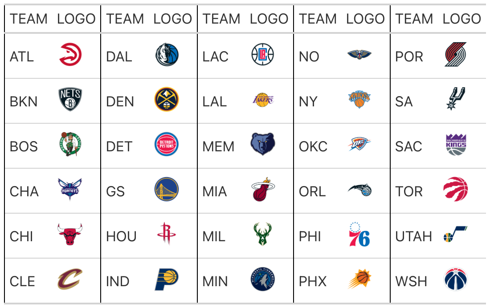

# Render NBA Logos in 'gt' Tables

Translate team abbreviations into logos and render these images in html
tables with the 'gt' package.

## Usage

``` r
gt_nba_logos(gt_object, columns, ..., height = 30, locations = NULL)
```

## Arguments

- gt_object:

  A table object that is created using the
  [`gt::gt()`](https://gt.rstudio.com/reference/gt.html) function.

- columns:

  The columns for which the image translation should be applied.
  Argument has no effect if `locations` is not `NULL`.

- ...:

  Currently not in use

- height:

  The absolute height (px) of the image in the table cell.

- locations:

  If `NULL` (the default), the function will render logos in argument
  `columns`. Otherwise, the cell or set of cells to be associated with
  the team name transformation. Only the
  [`gt::cells_body()`](https://gt.rstudio.com/reference/cells_body.html),
  [`gt::cells_stub()`](https://gt.rstudio.com/reference/cells_stub.html),
  [`gt::cells_column_labels()`](https://gt.rstudio.com/reference/cells_column_labels.html),
  and
  [`gt::cells_row_groups()`](https://gt.rstudio.com/reference/cells_row_groups.html)
  helper functions can be used here. We can enclose several of these
  calls within a [`list()`](https://rdrr.io/r/base/list.html) if we wish
  to make the transformation happen at different locations.

## Value

An object of class `gt_tbl`.

## Output of below example



## Examples

``` r
# \donttest{
teams <- nbaplotR::valid_team_names("NBA")
df <- data.frame(
  team_a = teams[1:6],
  logo_a = teams[1:6],
  team_b = teams[7:12],
  logo_b = teams[7:12],
  team_c = teams[13:18],
  logo_c = teams[13:18],
  team_d = teams[19:24],
  logo_d = teams[19:24],
  team_e = teams[25:30],
  logo_e = teams[25:30]
)
# create gt table and translate team names to logos
table <- df |>
  gt::gt() |>
  nbaplotR::gt_nba_logos(columns = gt::starts_with("logo")) |>
  gt::cols_label(
    gt::starts_with("team") ~ "TEAM",
    gt::starts_with("logo") ~ "LOGO"
  ) |>
  gt::tab_style(
    style = gt::cell_borders(side = "left"),
    locations = list(
      gt::cells_body(columns = gt::starts_with("team")),
      gt::cells_column_labels(columns = gt::starts_with("team"))
    )
  )
# }
```
